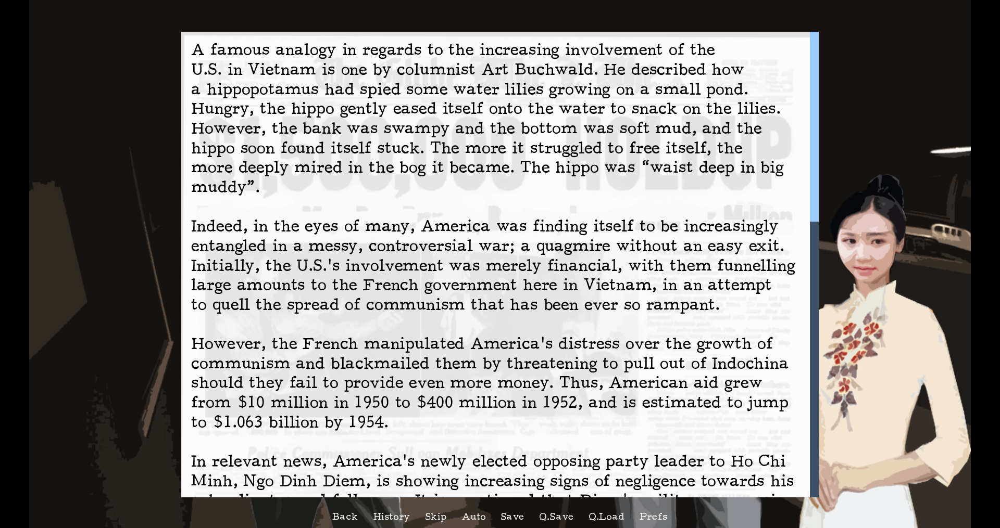
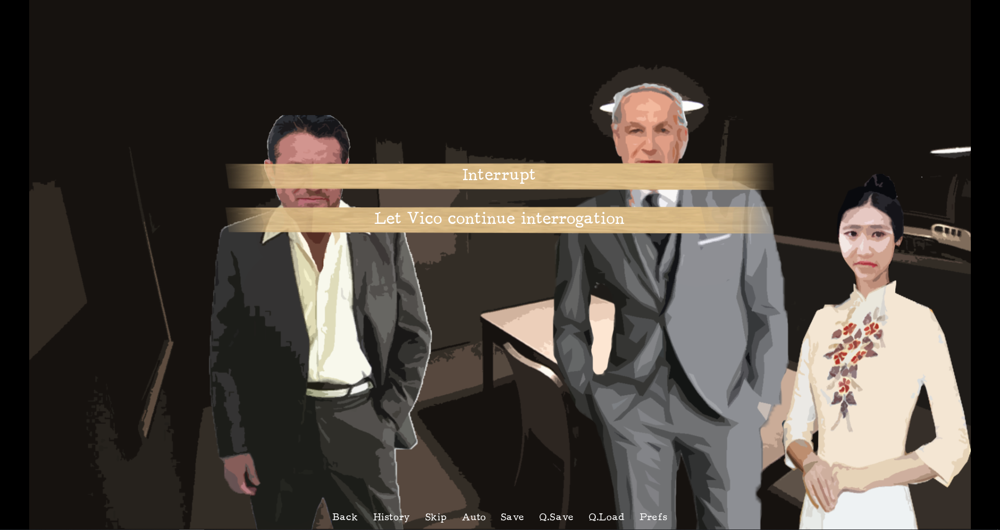
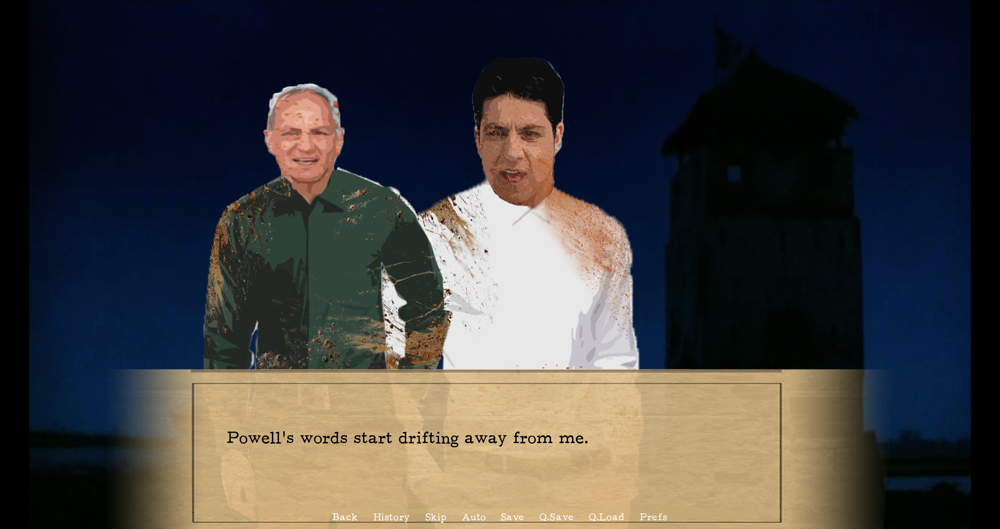

# Engaged
## About
Engaged is a visual novel based on the 2002 movie by Phillip Noyce and 1955 book by Graham Greene, both titled "The Quiet American".
In this game, you play as Fowelar, attempting to navigate a new norm that is now threatened by war and lost relationships. There are 8 different endings based on the choices you make.

Engaged was developed as a project for 02.157DH Histories on Screen: Framing Modern Southeast Asia.

Developed with:
* Ren'Py

Special thanks to my friend Naomi for the French translations!

## Features
* 8 different endings based on choices
* 9 short essays reflecting on the similarities and differences between the Vietnam War and the Malayan Emergency, and how they influenced each other yet still have drastic differences in 
the outcomes
* Expansion of the book and the movie

## Screenshots

  

  

  

## Release
No release due to copyright.

Compatible with Windows and Mac.

## Known Bugs and Issues
* No audio
* A minor bug in which a choice results in a loop.
